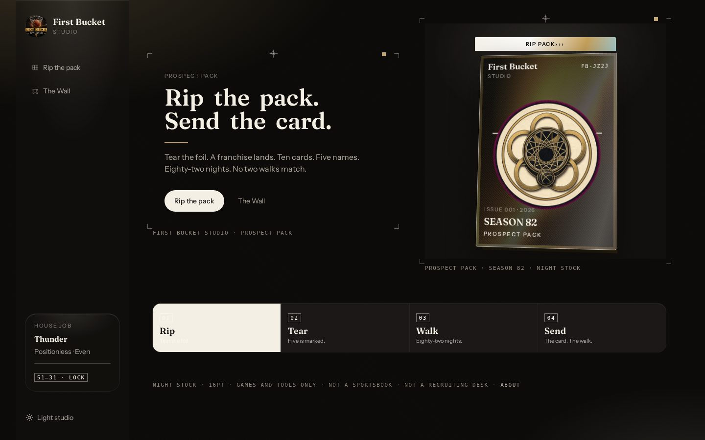
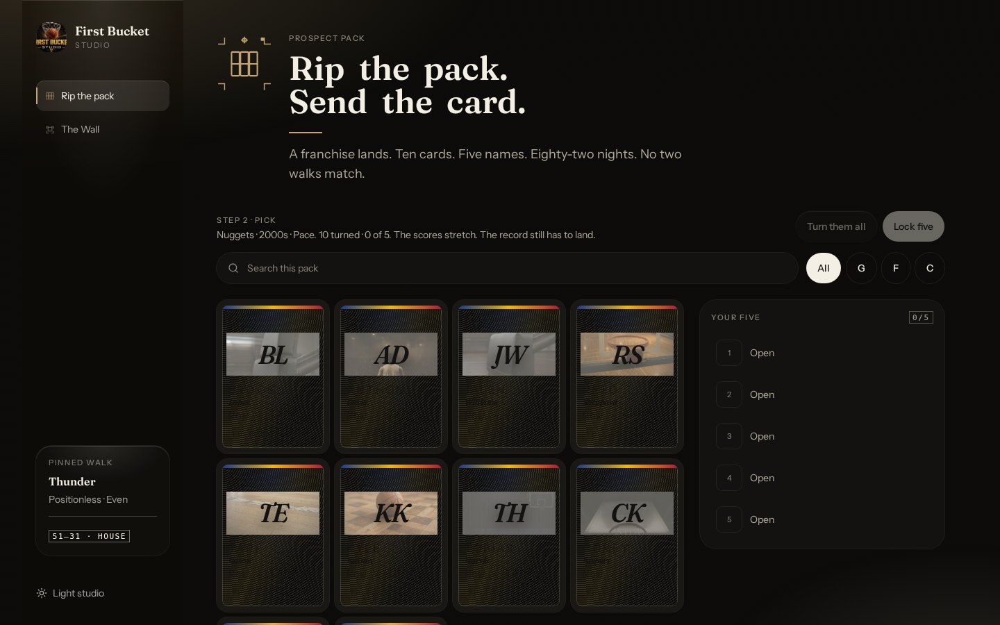
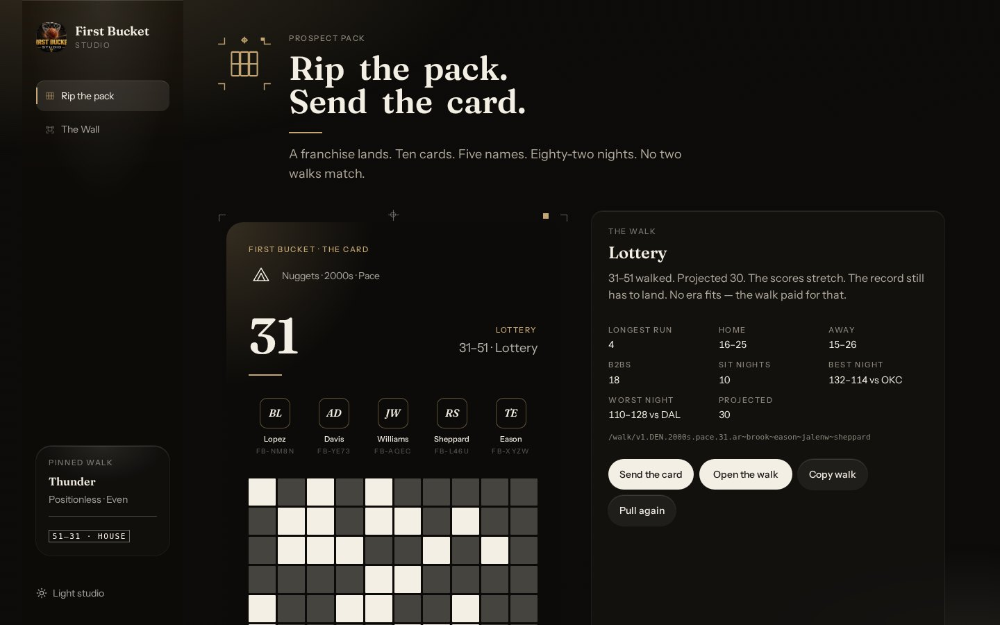
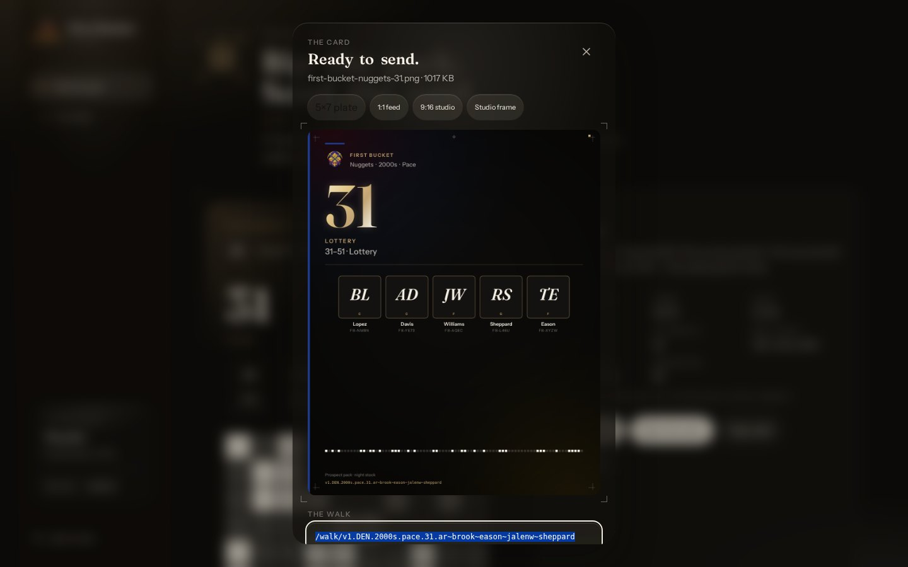

# First Bucket Studios

**Rip a pack. Five names. Eighty-two nights. Send the card.**

A browser basketball pack. Not a shop. Not a sportsbook. Not the NBA.

[Play](HOW-TO-PLAY.md) · [Fork](FORK.md) · [Contribute](CONTRIBUTING.md) · [MIT](LICENSE)

Private repo (log in as DigitalCurrensy):
**https://github.com/DigitalCurrensy/first-bucket-studios**

Not the older `first-bucket-studio` (no *s*).

---

## How to play

About ninety seconds. Full sheet: [HOW-TO-PLAY.md](HOW-TO-PLAY.md).

**1. Rip the pack.** A franchise, an era, and a luck lane land. No two pulls match.



**2. Tear the foil.** Ten cards. Tap five.



**3. Lock five.** The season walks. The number on the card is that walk.



**4. Send the card.** Save the PNG. Copy the walk. The URL is the certificate.



Tape of one pull: [docs/tape/demo.mp4](docs/tape/demo.mp4)

| You click | What it does |
| --- | --- |
| **Rip the pack** | Deals a new room. New ten. |
| **Lock five** | Walks 82 nights from those names. |
| **Send the card** | Opens the tray. |
| **Save the card** | Downloads `first-bucket-{team}-{wins}.png`. |
| **Copy the walk** | Copies `/walk/v1.…` — paste it anywhere. |
| **Open the walk** | Same five, same nights, forever. |

There is no “copy image.” The file is the card. The URL is the walk.

House job (optional) is pinned Thunder 51–31. The door is the live pack.

```
/walk/v1.OKC.positionless.even.51.chet~dort~hartenstein~jalenw~sga
```

---

## Install

Node 22. Auth off. Database unused.

```bash
git clone https://github.com/DigitalCurrensy/first-bucket-studios.git
cd first-bucket-studios
npm install
npm run dev
```

Then rip. If Save is swallowed, you are in a nested preview — open a top-level tab.

```bash
npm run test:pin
```

The house pin must stay green. That is the lock test.

More: [docs/STUDIO.md](docs/STUDIO.md) (update flow, themes).

---

## Documentation

| Doc | What it is |
| --- | --- |
| [HOW-TO-PLAY.md](HOW-TO-PLAY.md) | The ninety seconds |
| [docs/TESTING.md](docs/TESTING.md) | E2E layers: pin, funnel, demo eval, stills |
| [docs/ANALYTICS.md](docs/ANALYTICS.md) | Booth funnel. Local. No pixel. |
| [docs/WALK.md](docs/WALK.md) | Walk certificate (the wire format) |
| [docs/STUDIO.md](docs/STUDIO.md) | Specialists, themes, updates, performance, Action |
| [FORK.md](FORK.md) | Copy the loop. Swap the sport. |
| [NOTICE](NOTICE) | MIT is the code, not the names |
| [SUPPORT.md](SUPPORT.md) | How to ask |
| [SECURITY.md](SECURITY.md) | How to report a hole |
| [CONTRIBUTING.md](CONTRIBUTING.md) | How to land a patch |

### Install

See above. Node 22. `npm install` · `npm run dev`.

### Update flow

`git pull` → `npm install` if the lockfile moved → `npm run test:pin`. Walk `v1` is frozen. Mixer does not move. Details in [docs/STUDIO.md](docs/STUDIO.md#update-flow).

### Themes

Night arena (default) or light studio. Rail toggle. Stored on this device. Reduced motion skips the ticker.

### Walk certificate

`/walk/v1.{ABBR}.{era}.{luck}.{wins}.{five-ids}` is the save file. Nights recompute. [docs/WALK.md](docs/WALK.md).

### Specialists

Live pack, house pack, walk, foil, lithograph, tray, plates. One room per PR. [docs/STUDIO.md](docs/STUDIO.md#specialists).

### GitHub Action

[`.github/workflows/pin.yml`](.github/workflows/pin.yml) runs `npm run test:pin` on every push and pull request. Demo eval stays local (`npm run test:demo`) because it needs a running studio.

### Benchmarks

The pin is the benchmark: house walk is 51–31, same five, same nights. Live packs must not collapse to that id. Funnel target: card in under 90s.

### Performance

Foil is one WebGL layer with CSS fallback. Share is 2D canvas, not the foil. Ticker is 110ms/night, skipped on reduced motion. [docs/STUDIO.md](docs/STUDIO.md#performance).

### Demo evals

`npm run test:demo` — Playwright rips a live pack, asserts it is not the house pin, and opens the tray. [docs/TESTING.md](docs/TESTING.md).

---

## Community

Talk happens in **GitHub Discussions**. There is no Discord.

| Category | Use it for |
| --- | --- |
| **Q&A** | Setup help, “how do I”, Save / Copy / Open |
| **Ideas** | Feature proposals and design before any PR |
| **Show and tell** | Forks, other sports, stills, workflows |
| **Announcements** | Releases from the maintainers |

For a good Q&A answer fast, include the walk URL if you have one, your OS and browser, how you ran it, and whether Save was in a top-level tab or a nested preview. See [SUPPORT.md](SUPPORT.md). Bugs belong in issues. Security reports follow [SECURITY.md](SECURITY.md), never a public thread.

---

## Contributing

Contributions are welcome. Read [CONTRIBUTING.md](CONTRIBUTING.md), run `npm run test:pin`, and open a focused pull request.

Security reports should follow [SECURITY.md](SECURITY.md).

---

## License

[MIT](LICENSE). Invite the rip — [FORK.md](FORK.md).

Read [NOTICE](NOTICE) before you ship a fork with names on it. Plates, initials, and house crests are mitigations. They are not a license.

Built with Grok. Leave `public/__grok/` in place.
